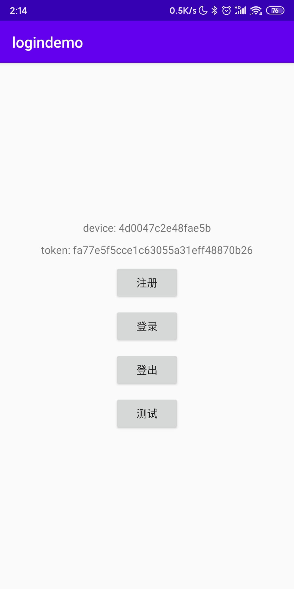
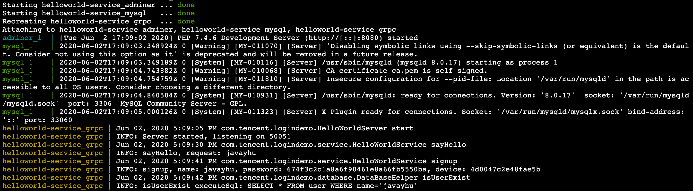
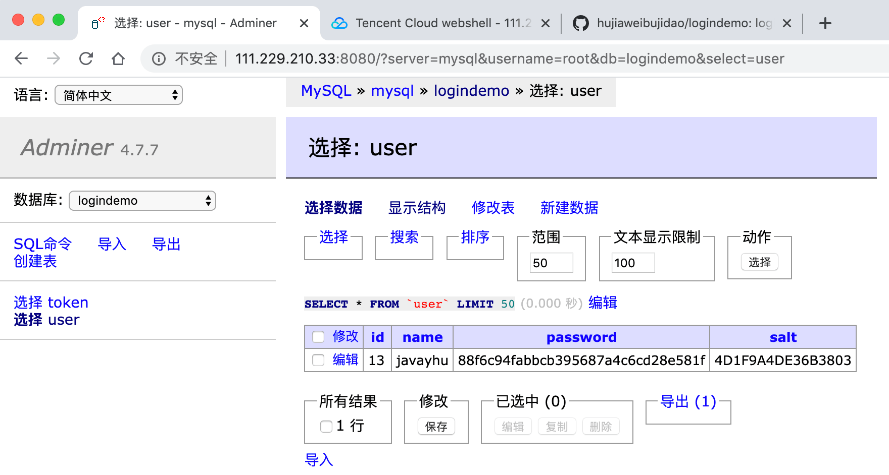
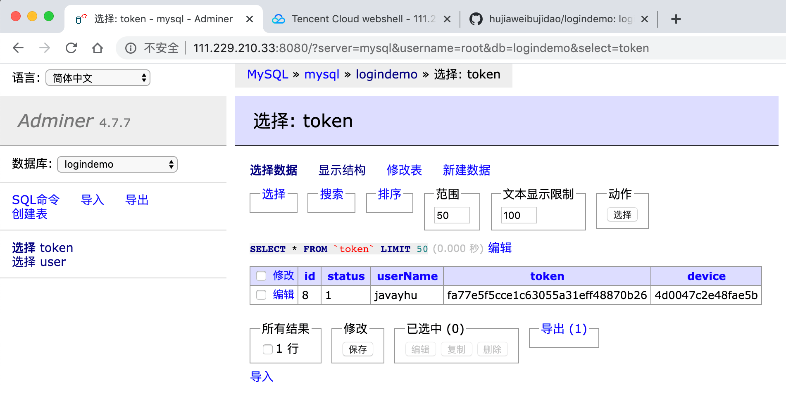

# logindemo

### 编程设计题

```
请设计⼀一套单终端登录系统，具备以下功能
1. 具备注册登录功能
2. ⼀个用户只能在⼀个设备上登录，切换终端登录时，其他已登录的终端会被踢出

请实现该系统的客户端及后台，要求:
1. 客户端登录模块需要采用C++实现iOS和android的跨平台
2. 终端app只要提供iOS或android⼀种客户端即可
3. 后台采⽤grpc实现，使用C++实现，⽤户信息存储上可以采⽤sql或nosql实现，设计时需要考虑敏感数据的安全性及传输安全性
4. 后台项⽬使用bazel编译及管理项目依赖
5. 项⽬设计实现周期两周左右，交付物包括可运行的客户端及后台项目代码，设计文档，使用github管理相关资源
6. 使⽤docker部署，docker compose管理项⽬
```

### 1、实现思路和项目技术栈

### 1.1 实现思路

> 如何实现账号注册登录？

服务器端维护两张表，user表和token表，user表保存注册用户的账号和密码等信息，token表保存用户的登录凭证、凭证状态和登录设备等信息。

数据库表结构详情见[db.sql](server/helloworld-service/mysql/database/db.sql)

user: id, name, password, salt    
token: id, userName, token, status, device

> 如何实现单终端登录？

1、在用户成功登录之后，服务器端会给客户端返回一个登录凭证token，并在token表中记录登录用户的设备信息和凭证状态(此时是有效)。    
2、当用户在其他终端登录时，服务器端会修改这个用户在token表中的token记录，更新登录凭证和设备信息，然后给之前登录的终端推送下线通知(这里未完成)；    
3、如果之前登录的终端当前并未在运行中，那么会在应用下次的时候检测token有效性时发现当前设备信息和数据库中保存的token记录对应的设备信息不同，从而提示用户要重新登录才能继续使用。

> 如何保证敏感数据的安全性？

用户密码是敏感数据，客户端传给后台之前要进行一次加密，后台也不是直接保存密码，而是给密码加盐之后再进行存储

> 如何保证数据传输的安全性？

客户端和服务器端采用HTTPS协议进行通信(暂未实现，需要有域名，并且这个域名要有SSL证书)

> 客户端和服务器端都有哪些接口？

共有4个接口，分别是注册、登录、登出和刷新token的功能

(1) 注册接口：用户输入账号密码，客户端将账号和加密后的密码以及设备信息传给后台，注册成功后台返回token信息    
```
signup(name:string, password:string, device:string): common_reponse;
```

(2) 登录接口：用户输入账号密码，客户端将账号和加密后的密码以及设备信息传给后台，后台验证账号密码是否都正确    
```
login(name:string, password:string, device:string): common_reponse;
````

(3) 登出接口：客户端将本地token传给后台，后台将这个token对应的记录的凭证状态设置为无效    
```
logout(token:string): common_reponse;
```

(4) 刷新token接口：应用启动的时候就会触发，如果用户在其他设备登录了或者其他原因导致token失效的话需要提示用户重新登录    
```
refreshToken(token:string, device:string): common_reponse;
```

### 1.2 项目技术栈

后台：Java + gRPC Java + MySQL + Docker    
Android： Kotlin + Coroutine + djinni + gRPC C++

### 2、代码编译和安装部署流程

开发环境：iMac macOS Mojave 10.14.6     
部署环境：腾讯云服务器 1核2G内存 Ubuntu 18.04

#### 2.1 获取代码

```
git clone https://github.com/hujiaweibujidao/logindemo.git
cd logindemo
git submodule update --init
```

#### 2.2 编译djinni源码 和 编译grpc源码

```
cd tools/djinni
src/build

cd tools/grpc
mkdir -p cmake/build
cd cmake/build
cmake ../..
make
```

#### 2.3 自动代码生成

利用前面编译djinni和grpc源码后得到的命令行工具去自动生成相关代码 (主要是给客户端用)

```
cd djinni
chmod +x run_djinni.sh
./run_djinni.sh

cd protos
chmod +x run_proto.sh
./run_proto.sh
```

#### 2.4 编译运行客户端

```
cd client/android
./gradlew installDebug
```

#### 2.5 部署后台服务

在腾讯云服务器上安装好docker和docker-compose

```
cd server/helloworld-service
docker-compose up
```

### 3、运行界面

#### 3.1 Android客户端



#### 3.2 运行在腾讯云服务器的后台







### 4、相关工具和参考资料

#### 4.1 开发工具

开发阶段会用到下面几个工具，原始下载链接速度很慢，换成用七牛云存放后下载(一般在云服务器中使用)

- docker-compose：http://video.pocketpoetry.club/docker-compose-Linux-x86_64
- bazel：http://video.pocketpoetry.club/bazel-3.1.0-installer-linux-x86_64.sh
- grpc archive (de195d3520a803fd6424bc33f154ba265af98bbe)：http://video.pocketpoetry.club/grpc-de195d3520a803fd6424bc33f154ba265af98bbe.tar.gz

#### 4.2 参考资料
- [Mobile C++ Tutorial, Hello World example](http://mobilecpptutorials.com/)
- [gRPC on Android, Hello World example](https://github.com/grpc/grpc/tree/master/examples/android/helloworld)
- [Ubuntu 18.04 install docker](https://zhuanlan.zhihu.com/p/57413820)
- [Getting Started with gRPC and Bazel](https://medium.com/@pencilflip/getting-started-with-grpc-and-bazel-24725fd9e5c2)
- [Setting Up a MySQL Database in Docker](https://medium.com/better-programming/setting-up-mysql-database-in-a-docker-d6c69a3e9afe)
- [Customize your MySQL Database in Docker](https://medium.com/better-programming/customize-your-mysql-database-in-docker-723ffd59d8fb)
- [gRPC C++ Quick Start](https://grpc.io/docs/quickstart/cpp/)
- [Using Docker to build and deploy a C++ gRPC service](https://github.com/hujiaweibujidao/grpc-cpp-docker)
- [Deploying a gRPC service written in C++](https://googlecloudrobotics.github.io/core/how-to/deploying-grpc-service.html)
- [grpc/cxx Docker](https://hub.docker.com/r/grpc/cxx/dockerfile)
- [Installing Bazel on Ubuntu](https://docs.bazel.build/versions/master/install-ubuntu.html)
- [docker run command](https://www.runoob.com/docker/docker-run-command.html)
- [Docker实用技巧之更改软件包源提升构建速度](https://juejin.im/entry/5b558d82f265da0fa644a8ab)
- [Docker镜像加速](https://www.runoob.com/docker/docker-mirror-acceleration.html)
- [@bazel_version//:bazel_version.bzl: The repository '@bazel_version' could not be resolved](https://github.com/grpc/grpc/issues/20511)
- [publish docker image: requested access to the resource is denied](https://stackoverflow.com/a/41984666)
- [grpc/grpc-java](https://github.com/grpc/grpc-java/tree/master/compiler)
- [加密算法的安全级别](https://www.cnblogs.com/davytitan/p/3850321.html)
- [图解HTTP](https://book.douban.com/subject/25863515/)
